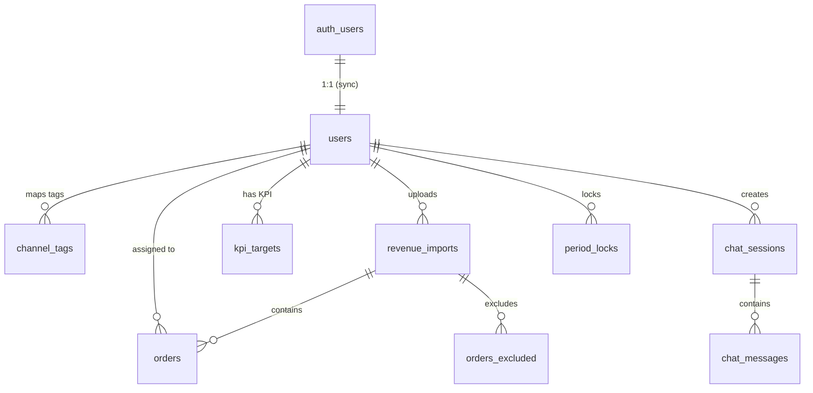

# 🗄️ Hướng dẫn tạo Database trên Supabase

> Dành cho dự án **HuyK Tools V1**. Làm theo từng bước, mất khoảng **15 phút**.

---

## 📋 Bước 1: Tạo project Supabase

1. Vào [supabase.com](https://supabase.com) → **Sign in** bằng GitHub
2. Bấm **New project**
3. Điền thông tin:

| Field | Giá trị |
|---|---|
| **Organization** | Chọn organization của bạn (hoặc tạo mới) |
| **Name** | `huyk-tools` |
| **Database Password** | Tạo password mạnh (lưu lại, cần sau này) |
| **Region** | **Southeast Asia (Singapore)** — gần VN nhất, latency thấp |
| **Pricing Plan** | **Free** — đủ dùng cho V1 (500MB DB, 50K users, 2GB storage) |

4. Bấm **Create project** → đợi ~2 phút

---

## 📋 Bước 2: Lấy Connection Keys

1. Trong Supabase Dashboard, vào **Project Settings → API**
2. Copy 3 giá trị sau:

| Key | Mô tả | Dùng ở đâu |
|---|---|---|
| **Project URL** | `https://xxxxx.supabase.co` | Client + Server |
| **anon public key** | `eyJhbGciOi...` (dài) | Client-side (an toàn để public) |
| **service_role key** | `eyJhbGciOi...` (dài) | **CHỈ Server-side**, không commit! |

3. Paste vào file `.env.local`:

```bash
NEXT_PUBLIC_SUPABASE_URL=https://xxxxx.supabase.co
NEXT_PUBLIC_SUPABASE_ANON_KEY=eyJhbGciOi...
SUPABASE_SERVICE_ROLE_KEY=eyJhbGciOi...
```

---

## 📋 Bước 3: Chạy SQL Migration

### Cách 1: SQL Editor (Khuyến nghị, đơn giản nhất)

1. Vào Supabase Dashboard → **SQL Editor** (menu trái)
2. Bấm **New query**
3. Mở file `supabase/migrations/001_initial_schema_v2.sql`, copy toàn bộ nội dung
4. Paste vào SQL Editor → bấm **Run** (Ctrl+Enter)
5. Kết quả: `Schema V1 created successfully! Tables: users, channel_tags, ...`

6. Bấm **New query** lần nữa
7. Mở file `supabase/migrations/002_seed_data.sql`, copy toàn bộ → **Run**
8. Kết quả: `✅ Seed complete! 27 tags inserted.`

### Cách 2: Supabase CLI

```bash
# Cài Supabase CLI (nếu chưa có)
npm install -g supabase

# Login
supabase login

# Link project
supabase link --project-ref <your-project-ref>

# Push schema lên
supabase db push
```

---

## 📋 Bước 4: Setup Auth (Google OAuth)

1. Vào **Authentication → Providers**
2. Bật **Email/Password**:
   - ✅ Enable Email provider
   - ✅ Confirm email (gửi email xác nhận)
3. Bật **Google** (nếu muốn login bằng Google):
   - Toggle ON
   - Cần Google Cloud Client ID & Secret
   - Authorized redirect URI: `https://xxxxx.supabase.co/auth/v1/callback`

4. Vào **Authentication → URL Configuration**:
   - Site URL: `http://localhost:3000` (dev) hoặc domain production
   - Redirect URLs: `http://localhost:3000/api/auth/callback`

---

## 📋 Bước 5: Kiểm tra

Sau khi chạy migration xong, kiểm tra trong Supabase Dashboard:

### Table Editor
Vào **Table Editor** (menu trái), bạn sẽ thấy 9 bảng:

| # | Bảng | Mô tả |
|---|---|---|
| 1 | `users` | Người dùng (sync từ auth.users) |
| 2 | `channel_tags` | 27 tag kênh → mapping nhân viên |
| 3 | `revenue_imports` | Log mỗi lần upload Excel |
| 4 | `orders` | Đơn hàng đã được tính doanh thu |
| 5 | `orders_excluded` | Đơn bị loại + lý do |
| 6 | `kpi_targets` | Mục tiêu KPI từng nhân viên |
| 7 | `period_locks` | Chốt sổ tháng |
| 8 | `chat_sessions` | Phiên chat chatbot |
| 9 | `chat_messages` | Tin nhắn trong phiên chat |

### Channel Tags
Vào bảng `channel_tags` → sẽ thấy 27 dòng với `employee_id = NULL` (chưa map).

### Test Auth
Chạy `pnpm dev`, vào `http://localhost:3000/signup`, tạo tài khoản. Sau đó vào Supabase → **Authentication → Users** để xác nhận user đã được tạo.

---

## 📋 Bước 6: Set Admin cho user đầu tiên

Sau khi đăng ký tài khoản đầu tiên, vào **SQL Editor** chạy:

```sql
UPDATE public.users SET role = 'admin' WHERE email = 'your-email@example.com';
```

User này sẽ có quyền:
- Quản lý mapping tag → nhân viên
- Chốt sổ tháng
- Quản lý KPI targets
- Xem tất cả dữ liệu

---

## 🗺️ Sơ đồ quan hệ các bảng



---

## ⚠️ Những điểm cần lưu ý

### 1. KHÔNG dùng `order_code` làm Primary Key
Migration sử dụng UUID `id` + unique constraint `(order_code, period)`. Lý do:
- 1 đơn có thể xuất hiện ở nhiều period khác nhau?
- UUID linh hoạt hơn khi cần mở rộng

### 2. Channel Tags có Versioning
Mỗi tag có `effective_from` / `effective_to`. Khi admin đổi người phụ trách 1 tag:
```sql
-- Đóng mapping cũ
UPDATE channel_tags SET effective_to = '2026-06-30' WHERE tag_normalized = 'page_huyk-kim hoàn' AND effective_to IS NULL;
-- Tạo mapping mới
INSERT INTO channel_tags (tag_original, tag_normalized, employee_id, platform, effective_from)
VALUES ('page_HuyK - Kim Hoàn', 'page_huyk-kim hoàn', 'NEW_EMPLOYEE_UUID', 'facebook', '2026-07-01');
```
→ Đơn tháng 6 vẫn tính cho nhân viên cũ, tháng 7 tính cho nhân viên mới.

### 3. RLS (Row Level Security) đã được setup
Mọi bảng đều có RLS policy phù hợp. Service role key dùng trong API routes để bypass RLS khi cần.

### 4. Trigger `handle_new_user` tự động tạo profile
Khi user đăng ký qua Supabase Auth → tự động insert vào `public.users`. Không cần code thêm.

---

## 🔄 Rollback / Reset DB

Nếu cần reset toàn bộ:

```sql
-- XÓA TOÀN BỘ DỮ LIỆU (cẩn thận!)
DROP TABLE IF EXISTS public.chat_messages CASCADE;
DROP TABLE IF EXISTS public.chat_sessions CASCADE;
DROP TABLE IF EXISTS public.orders_excluded CASCADE;
DROP TABLE IF EXISTS public.orders CASCADE;
DROP TABLE IF EXISTS public.kpi_targets CASCADE;
DROP TABLE IF EXISTS public.period_locks CASCADE;
DROP TABLE IF EXISTS public.revenue_imports CASCADE;
DROP TABLE IF EXISTS public.channel_tags CASCADE;
DROP TABLE IF EXISTS public.users CASCADE;

-- Chạy lại migration từ đầu
```

---

## ✅ Checklist hoàn thành

- [ ] Tạo project Supabase (Singapore region)
- [ ] Lấy 3 key (URL, anon, service_role) → điền `.env.local`
- [ ] Chạy `001_initial_schema_v2.sql` → 9 bảng được tạo
- [ ] Chạy `002_seed_data.sql` → 27 tag kênh được seed
- [ ] Bật Email Auth provider
- [ ] (Tuỳ chọn) Bật Google OAuth
- [ ] Cấu hình Site URL + Redirect URL
- [ ] Đăng ký user đầu tiên → set role = 'admin'
- [ ] Vào Table Editor xác nhận tất cả bảng có dữ liệu đúng
